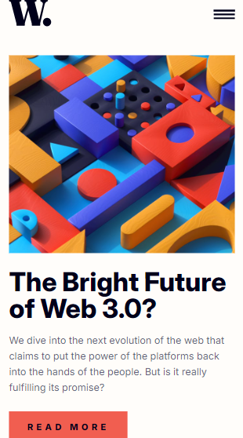

# News Homepage

This is a solution to the News Homepage challenge on Frontend Mentor. It is a modern and responsive news website layout built to practice CSS Grid and layout structuring.

---

## Table of Contents

- [Overview](#overview)
  - [The Challenge](#the-challenge)
  - [Screenshot](#screenshot)
  - [Links](#links)
- [My Process](#my-process)
  - [Built With](#built-with)
  - [What I Learned](#what-i-learned)
  - [Continued Development](#continued-development)
- [Author](#author)

---

## Overview

### The Challenge

Users should be able to:

- View the optimal layout depending on their device's screen size
- See hover and focus states for interactive elements
- Navigate through a visually structured news homepage
- Experience a clean and modern UI layout

---

### Screenshot

| Desktop | Mobile |
|---------|--------|
|  |  |

---

### Links

- Repository:  
  https://github.com/IrfanAnsari21/news-homepage.git  

- Live Site:  
  https://irfanansari21.github.io/news-homepage/

---

## My Process

### Built With

- Semantic HTML5
- CSS Grid
- CSS Flexbox
- Responsive Design
- JavaScript

---

### What I Learned

- Creating complex layouts using CSS Grid
- Structuring content for better readability and UX
- Combining Grid and Flexbox effectively
- Improving responsive design skills
- Writing cleaner and more maintainable CSS

---

### Continued Development

- Improve accessibility (ARIA roles, better semantics)
- Add more interactivity using JavaScript
- Optimize layout for performance
- Enhance UI polish and animations

---

## Author

- GitHub:  [@IrfanAnsari21](https://github.com/IrfanAnsari21)

- Frontend Mentor:  [@IrfanAnsari21](https://www.frontendmentor.io/profile/IrfanAnsari21)

---

## Acknowledgments

Thanks to **Frontend Mentor** for providing this challenge to improve real-world frontend skills.